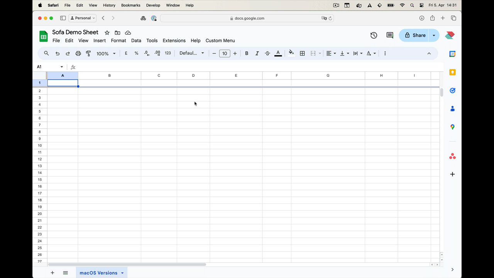

# Examples

## Jamf Extension Attributes (EA)

### macOSVersionCheck-EA.sh

Verifying that the system version of macOS is up to date is traditionally achieved by polling the `softwareupdate` binary or checking the file `/Library/Preferences/com.apple.SoftwareUpdate.plist` to look for any available updates. However, if `softwareupdate` or the internal Software Update mechanism is not performing properly on the system, updates may not be reported.

However, SOFA provides a list of the latest available versions of macOS which can easily be polled.

This script can be used as an Extension Attribute in Jamf Pro to report whether macOS is up to date. It requires macOS 12 or above.

Since SOFA includes hardware compatibility data for all available software updates, this script uses that information to find out what is the current latest available compatible version of macOS for the system on which the script is running, and compares that with the current system.

Here's a breakdown of what it does:

1. It retrieves the current latest available macOS version by using `curl` to fetch JSON data from the specified URL, then uses `plutil` to extract the version string. Note that a check is made to see if the cached version of the JSON file matches the current online version - this prevents unnecessary data transfer.

2. It retrieves the local version of macOS using the command `/usr/bin/sw_vers -productVersion`, and determines the hardware model using `/usr/sbin/sysctl -n hw.model`.

3. It compares the local system version of macOS with the latest available compatible macOS version as reported in the SOFA JSON file. If they match, it returns `<result>Pass</result>`, indicating that the system is up to date. Otherwise, it returns `<result>Fail</result>`.

### macOSCVECheck-EA.sh

SOFA gives information about CVEs that were reported as patched in every macOS release. We can therefore use this information along with a check to see if the system is running the latest available macOS, in order to provide information about how many unpatched CVEs are present on the local system.

This script can be used as an Extension Attribute in Jamf Pro to report whether macOS is up to date. It requires macOS 12 or above.

To be generous, this script only checks for unpatched CVEs within the currently running major OS version. So if the system is running macOS Ventura 13.5, it will only list CVEs that have ben reported in the releases of Ventura since 13.5 - it won't look at the CVEs reported in macOS Sonoma 14.

Here's a breakdown of what it does:

1. It retrieves the current latest available macOS version by using `curl` to fetch JSON data from the specified URL, then uses `plutil` to extract the version string. Note that a check is made to see if the cached version of the JSON file matches the current online version - this prevents unnecessary data transfer.

2. It retrieves the local version of macOS using the command `/usr/bin/sw_vers -productVersion`, and determines the hardware model using `/usr/sbin/sysctl -n hw.model`.

3. It compares the local system version of macOS with the latest available minor macOS version within that major version, as reported in the SOFA JSON file. If the system is running the latest OS, then no CVEs will be reported as follows: `<result>CVEs:0 ActiveExploits:0</result>`. Note that actively exploited CVEs ("zero days" or "0days") are listed separately.

4. If the system is not running the latest version of the macOS major release, it counts back through all the releases between the latest available version and the current system version, and returns the total count of CVES, as in the following example: `<result>CVEs:23 ActiveExploits:1</result>`.

The information in the result string from the EA can be used in Smart Groups using regex matching. For example , to check only for Active Exploits, you can use the following criterion:

| Criterion Name  | Operator      | Value                  |
| --------------- | ------------- | ---------------------- |
| macOS CVE Check | matches regex | `ActiveExploits:[1-9]` |

| Criterion Name  | Operator      | Value        |
| --------------- | ------------- | ------------ |
| macOS CVE Check | matches regex | `CVEs:[1-9]` |

### macOSCompatibilityCheck-EA.sh

This script determines whether the system supports the latest available macOS version. This can help you determine whether it's time to replace the machine.

This script can be used as an Extension Attribute in Jamf Pro. It requires macOS 12 or above.

Here's a breakdown of what it does:

1. It retrieves the current latest available macOS version by using `curl` to fetch JSON data from the specified URL, then uses `plutil` to extract the version string. Note that a check is made to see if the cached version of the JSON file matches the current online version - this prevents unnecessary data transfer.

2. It determines the hardware model using `/usr/sbin/sysctl -n hw.model`.

3. It retrieves the current latest available macOS version from the JSON file that is compatible with the current system, then uses `plutil` to extract the version string.

4. It compares the latest available version of macOS with the latest available macOS version that is compatible on the system, as reported in the SOFA JSON file. If they match, it returns `<result>Pass</result>`, indicating that the system can support the latest version of maCOS. Otherwise, it returns `<result>Fail</result>`.

### XProtectVersionCheck-EA.sh

The [mSCP project](https://github.com/usnistgov/macos_security) and CIS Benchmark (1.6) both ask for software update to be set to update XProtect automatically.

This script can be used as an Extension Attribute in Jamf Pro to report whether the XProtect components are up to date. It requires macOS 12 or above.

The script will check the version of XProtect (Apple's built-in malware protection) on a macOS system. Here's a breakdown of what it does:

1. It retrieves the latest available XProtect version by using `curl` to fetch JSON data from the specified URL, then uses `plutil` to extract the version string. Note that a check is made to see if the cached version of the JSON file matches the current online version - this prevents unnecessary data transfer.

2. It retrieves the local version of XProtect configuration data from `/Library/Apple/System/Library/CoreServices/XProtect.bundle/Contents/Info.plist`, as well as the version of XProtect Remediator (`XProtect.app`).

3. It compares local versions of both XProtect and XProtect Remediator with the latest versions as reported in the SOFA JSON file. If they match, it returns `<result>Pass</result>`, indicating that the versions are up to date. Otherwise, it returns `<result>Fail</result>`.

## SwiftDialog

### XProtectVersionCheck-swiftDialog.sh

This script illustrates how to use SwiftDialog to show information about XProtect on macOS. Here's a breakdown of its functionality:

1. Two variables specify the paths to the `Info.plist` files for both the XProtect Bundle and XProtect Remediator.

2. The URL is set here to get the latest XProtect version information from the online SOFA JSON data feed.

3. It retrieves the local version of XProtect configuration data from `/Library/Apple/System/Library/CoreServices/XProtect.bundle/Contents/Info.plist` as well as the Xprotect Remediator `XProtect.app` version info.

4. It compares local versions of both XProtect and XProtect Remediator with the latest versions as reported in the SOFA JSON file. If they match, it sets a message indicating that the versions are up-to-date. Otherwise, it sets a message indicating a version mismatch, suggesting to check for updates.

5. It calls swiftDialog to display a dialog with the generated message. The message includes details such as local and online versions of XProtect bundle and XProtect Remediator.

## Google Sheets

### GoogleSheet.gs

This demo uses data from the feed to create a table. It can help align historic OS update data with your live status within the fleet. Having info on OS updates may serve as a foundation to present tangible information on Apple OS releases to management and other departments in a common format.

#### Notes

1. **Open Google Sheets**
   - Go to [Google Sheets](https://sheets.google.com) and sign in to your Google account if you're not already signed in.

2. **Create a new spreadsheet**
   - Click on the "+" icon or "Blank" to create a new spreadsheet.

3. **Open script editor**
   - In the menu, go to `Extensions > Apps Script`.
   - This will open the Google Apps Script editor in a new tab.

4. **Paste your script**
   - In Apps Script editor, delete any existing code and paste your `GoogleSheet.gs` script.

5. **Save the script**
   - Give your project a name by clicking on "Untitled project" at the top left and entering a name.
   - Click the disk icon or `File > Save` to save your script.

6. **Authorize Google Script**
   - If prompted, review the permissions required by the script and click "Authorize" to grant access. This is necessary for the script to interact with your Google Sheets.

7. **Close script editor**
   - Close the script editor tab to return to your Google Sheets.

8. **Run the script**
   - In your Google Sheet, go to `Extensions > Macros > GoogleSheet` (or whatever name you've given to your script).
   - Click on `fetchJsonAndPopulateSheet` to run the script.

9. **View results**
   - After the script finishes running, you should see the data populated in your Google Sheet.

10. **Adjust as needed**
    - You can modify the script as needed, for example, by changing URLs, adjusting data formatting, create charts, or adding more functionality.

#### Demo: Populate feed details into table with GoogleSheet.gs script

