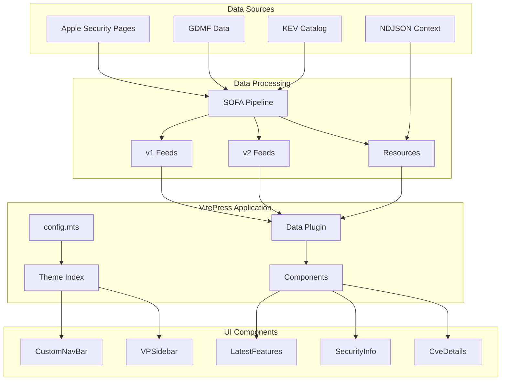
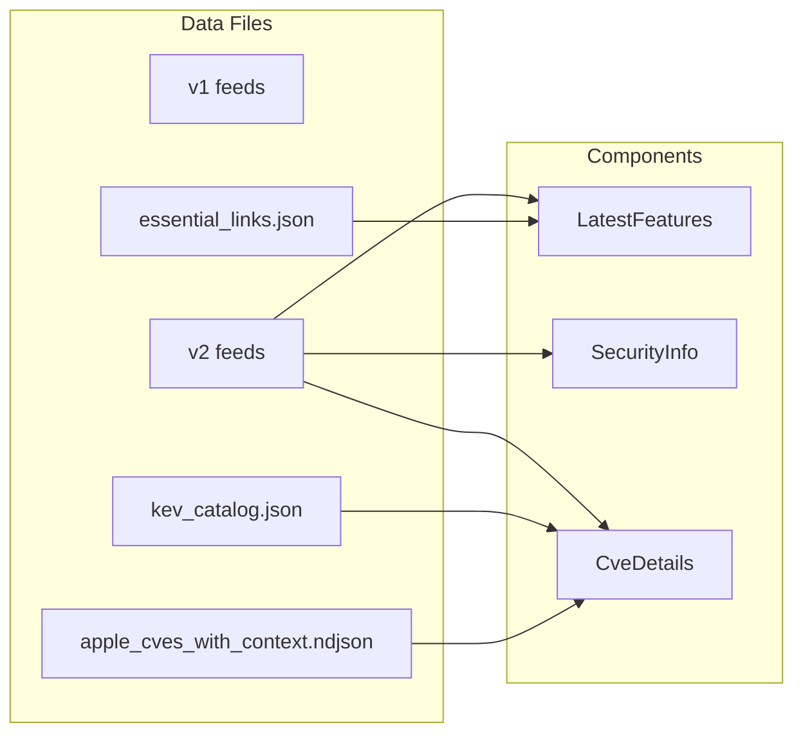
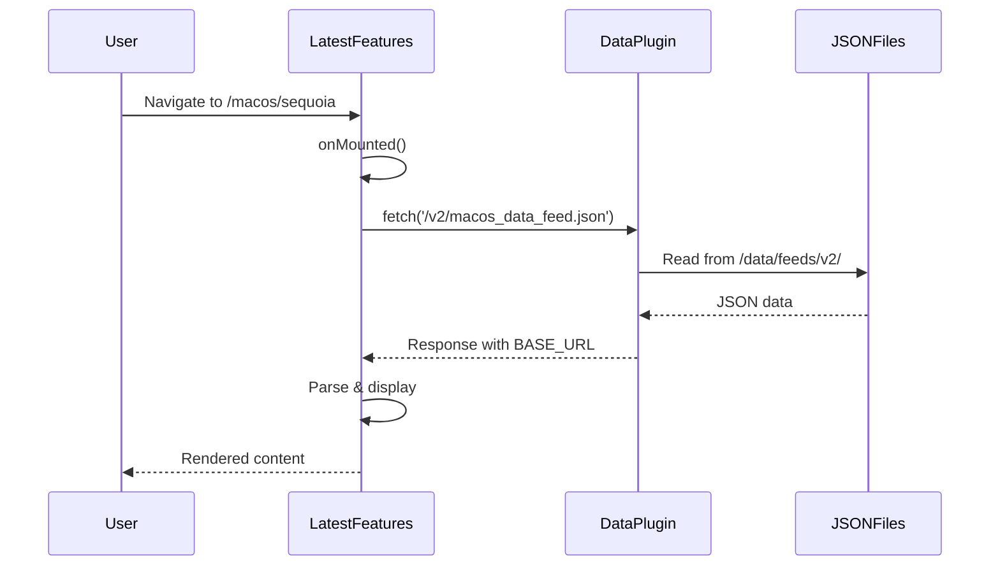

# SOFA 2.0 Refinement Documentation

## System Architecture & Relationships



## Component Relationships & Data Flow

### 1. Configuration Hierarchy
```
config.mts (MUST be .mts, not .ts!)
├── Base URL (/sofa-2.0/)
├── Theme Config
│   ├── Navigation
│   └── Sidebar Structure
│       ├── macOS
│       ├── iOS/iPadOS
│       ├── Safari
│       ├── tvOS
│       ├── visionOS
│       ├── watchOS
│       └── Tools
└── Vite Config
    └── dataPlugin.mts
```

### 2. Theme Architecture
```
theme/index.ts
├── extends: DefaultTheme
├── Layout: DefaultTheme.Layout with slots
│   ├── 'layout-top' → CustomNavBar
│   └── 'layout-bottom' → DataSourceDebug
└── enhanceApp: Global component registration
    ├── LatestFeatures
    ├── SecurityInfo
    ├── CveDetails
    └── [15+ other components]
```

### 3. Data Loading Architecture

#### Development Flow
```
/data/feeds/v1/*.json
/data/feeds/v2/*.json     → dataPlugin.mts → HTTP Server → Components
/data/resources/*.json                         ↓
                                    Maps: /v2/ → feeds/v2/
                                          /v1/ → feeds/v1/
```

#### Production Flow
```
/docs/public/v1/*.json
/docs/public/v2/*.json     → Static Files → Components
/docs/public/resources/*
```

### 4. Component Data Dependencies



## Critical Implementation Details

### Sidebar Fix Path
```
Problem: "Getting Started, Introduction, Quick Start" showing
↓
Discovery: Two config files exist
├── config.ts (with default content) ❌
└── config.mts (with SOFA content) ✅
↓
Solution: Remove config.ts, keep only config.mts
↓
Result: Correct sidebar with macOS, iOS, etc.
```

### Data Loading Solution Evolution
```
Attempt 1: Symlinks → Failed (VitePress doesn't follow)
↓
Attempt 2: Remote URLs → User said "NOOO load locally"
↓
Attempt 3: Complex middleware → Overcomplicated
↓
Solution: Copy to public/ + dataPlugin for dev
```

### Layout Strategy Evolution
```
Attempt 1: Custom Layout.vue with manual sidebar → Sidebar broke
↓
Attempt 2: DefaultTheme.Layout with wrapper → Lost context
↓
Solution: DefaultTheme.Layout with slots (from working UI)
```

## CVE Details Enrichment Layers

### Layer 1: Feed Data
- Basic CVE presence
- Version affected
- Release dates

### Layer 2: NDJSON Context
```json
{
  "tags": ["platform:ios", "bypass", "memory"],
  "platforms_with_fix": ["iOS", "macOS"],
  "exploitation_evidence": ["CISA KEV catalog"],
  "apple_security_bulletin_urls": [...]
}
```

### Layer 3: KEV Catalog
```json
{
  "shortDescription": "Apple iOS Out-of-Bounds Write",
  "vulnerabilityName": "Apple iOS Image I/O Vulnerability",
  "cwes": ["CWE-787"],
  "requiredAction": "Apply mitigations per vendor",
  "dueDate": "2025-09-11"
}
```

### Visual Result
```
CVE-2025-43300
├── Tags: [iOS] [MACOS] [BYPASS] [MEMORY]
├── KEV Badge: "Actively Exploited"
├── Description: From KEV shortDescription
├── CWEs: [CWE-787] → Links to MITRE
├── Impact: KEV vulnerabilityName + required action
└── References: Apple bulletins + NIST NVD
```

## Component Communication Pattern



## File Structure Relationships

```
/sofa-2.0-starter/
├── data/                     # Source of truth
│   ├── feeds/
│   │   ├── v1/              # Legacy format
│   │   └── v2/              # Enhanced with SecurityInfoContext
│   └── resources/
│       ├── apple_cves_with_context.ndjson
│       └── kev_catalog.json
│
├── docs/
│   ├── .vitepress/
│   │   ├── config.mts       # ⚠️ ONLY .mts!
│   │   ├── dataPlugin.mts   # Dev server middleware
│   │   └── theme/
│   │       ├── index.ts     # No Layout.vue needed!
│   │       └── components/
│   │
│   └── public/              # Production data copy
│       ├── v1/
│       ├── v2/
│       └── resources/
│
└── sofa-summer-25-250812-working-ui/  # Reference implementation
```

## Success Criteria Checklist

✅ **Sidebar**: Shows macOS, iOS, Safari, tvOS, visionOS, watchOS, Tools
✅ **Data Loading**: Fetches from /v2/ and /v1/ with BASE_URL
✅ **Images**: Load from public/ with proper paths
✅ **CVE Details**: Show tags, CWEs, KEV data
✅ **Custom Navbar**: SOFA branding at top
✅ **Security Info**: Displays real SecurityInfoContext
✅ **No duplicate configs**: Only config.mts exists

## Key Learnings

1. **VitePress Config Priority**: `.ts` loads before `.mts` - never have both
2. **Data Serving**: Public directory for production, dataPlugin for dev
3. **Theme Slots**: Better than custom Layout.vue for maintaining VitePress features
4. **BASE_URL**: Always use for assets and fetch URLs
5. **Global Registration**: Components registered in theme don't need imports in markdown
6. **NDJSON Processing**: Parse line-by-line, skip metadata line
7. **Sidebar Context**: Must use DefaultTheme.Layout to get config sidebar

## Debug Toolbox

```bash
# Quick health check
ls -la .vitepress/config.* | grep -E "\.ts$|\.mts$"

# Test data availability
curl -s http://localhost:5173/sofa-2.0/v2/macos_data_feed.json | jq '.OSVersions[0].Latest.ProductVersion'

# Check CVE enrichment
curl -s http://localhost:5173/sofa-2.0/resources/kev_catalog.json | jq '.vulnerabilities[0]'

# Clear all caches
rm -rf node_modules/.vitepress/dist .vitepress/cache .vitepress/temp

# Verify public data
ls -la public/v2/*.json | wc -l  # Should show feed files
```

## Recovery Procedures

### If sidebar shows wrong content:
1. Check for duplicate configs: `ls .vitepress/config.*`
2. Remove any `.ts` file, keep only `.mts`
3. Restart dev server

### If data won't load:
1. Verify files in public: `ls public/v2/`
2. Check BASE_URL in fetch calls
3. Test with curl: `curl http://localhost:5173/sofa-2.0/v2/macos_data_feed.json`

### If images 404:
1. Check public directory: `ls public/*.png`
2. Verify getAssetPath uses BASE_URL
3. Test direct URL: `http://localhost:5173/sofa-2.0/SWUpdate.png`

---

*This document represents the complete implementation journey and serves as the authoritative reference for SOFA 2.0 architecture.*